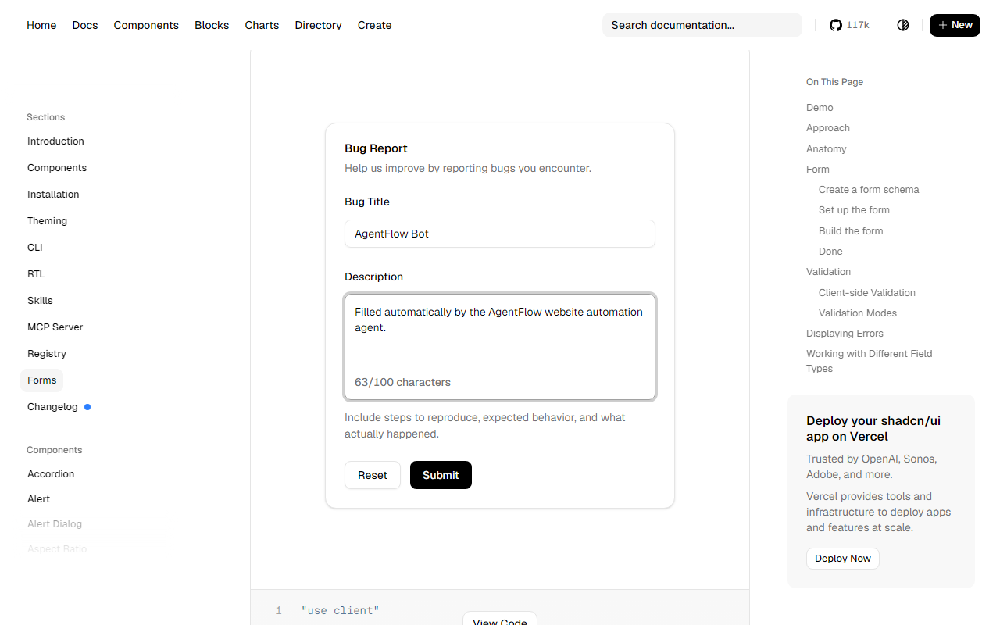

# AgentFlow — Website Automation Agent

An intelligent browser-automation agent built with **Python + Playwright**. It
navigates to a target page, **autonomously identifies the form fields**, and
fills them in — a mini version of tools like [Browser Use](https://github.com/browser-use/browser-use).

It ships with **two interchangeable "brains"**:

| Mode | How it decides what to do | Needs an API key? |
|------|---------------------------|-------------------|
| **`deterministic`** (default) | Rule-based, accessibility-aware element detection. Reliable — best for a live demo. | ❌ No |
| **`llm`** | Claude reads screenshots and decides each click/keystroke (true "computer use"). | ✅ Yes (`ANTHROPIC_API_KEY`) |

Both brains drive the page through the **same coordinate-based tool belt**, so
clicks are real `mouse.click(x, y)` actions at computed pixel coordinates — not
selector shortcuts.

---

## The target task

Navigate to <https://ui.shadcn.com/docs/forms/react-hook-form>, find the form's
**Name/Title** and **Description** fields, and fill them.

> **Note on the page:** the featured form currently labels its text field
> **"Bug Title"** (not "Name"), with a **"Description"** textarea below it. The
> agent does **not** hard-code labels — it locates fields by *role and
> structure*, so it fills whatever Name/Title + Description fields exist. This
> is the "agent intelligence" the task rewards. Verified output:
>
> 

---

## Required tools — and where they live

Every capability the assignment asks for is a single method on
[`agent/tools.py`](agent/tools.py) → `BrowserTools`:

| Required tool | Method |
|---------------|--------|
| `open_browser` | `open_browser()` |
| `navigate_to_url` | `navigate_to_url(url)` |
| `take_screenshot` | `take_screenshot(name)` |
| `click_on_screen(x, y)` | `click_on_screen(x, y)` |
| `double_click` | `double_click(x, y)` |
| `send_keys` | `send_keys(text)` |
| `scroll` | `scroll(direction, amount)` |

---

## Setup

Requires **Python 3.10+**.

```bash
# 1. (optional) create a virtual environment
python -m venv .venv
# Windows:  .venv\Scripts\activate
# macOS/Linux:  source .venv/bin/activate

# 2. install dependencies
pip install -r requirements.txt

# 3. install the Playwright browser binary (one-time)
python -m playwright install chromium

# 4. (optional) configure — only needed to change defaults or use LLM mode
cp .env.example .env
```

---

## Run it

```bash
# Deterministic agent, visible browser (recommended for a demo)
python main.py

# Headless
python main.py --headless

# Keep the window open at the end so you can inspect the result
python main.py --keep-open

# Fill the form AND click Submit
python main.py --submit

# Type your own values
python main.py --name "Jane Doe" --description "A note longer than twenty chars."

# LLM-vision agent (requires ANTHROPIC_API_KEY in your environment or .env)
python main.py --mode llm
```

Run `python main.py --help` for all flags.

### Web dashboard (optional)

A FastAPI dashboard streams the agent's logs and screenshots live in the browser
— handy for a demo and the surface that gets deployed:

```bash
python dashboard.py          # then open http://localhost:7860
```

Pick a brain, set the field values, hit **Run agent**, and watch the log fill in
and screenshots appear as it works. To put it on a public URL (Docker → Hugging
Face Spaces), see [DEPLOY.md](DEPLOY.md).

### What you get

- A **live trace** in the console *and* in `logs/agentflow.log` — every tool
  call and every decision.
- Screenshots in `screenshots/` (`01-initial.png`, `02-filled.png`, …) so each
  run is auditable after the fact.

Example console output:

```
TOOL navigate_to_url(https://ui.shadcn.com/docs/forms/react-hook-form)
Detected Name/Title field: <input> label/placeholder='Bug Title'
Detected Description field: <textarea> label/placeholder='Description'
TOOL scroll(direction=down, amount=499)
TOOL click_on_screen(x=640, y=299)
TOOL send_keys('AgentFlow Bot')
Verify name field: OK (value='AgentFlow Bot')
TOOL double_click(x=640, y=425)
TOOL send_keys('Filled automatically by the AgentFlow website automation agent.')
Verify desc field: OK (value='Filled automatically by ...')
```

---

## Configuration

All settings come from environment variables (or a local `.env`). Every value
has a default, so `.env` is optional for the deterministic agent. See
[`.env.example`](.env.example) for the full list. Highlights:

| Variable | Default | Purpose |
|----------|---------|---------|
| `ANTHROPIC_API_KEY` | – | Required only for `--mode llm` |
| `ANTHROPIC_MODEL` | `claude-opus-4-8` | Model for the LLM-vision agent |
| `AGENTFLOW_TARGET_URL` | shadcn forms page | Page to automate |
| `AGENTFLOW_NAME_VALUE` | `AgentFlow Bot` | Text for the Name/Title field |
| `AGENTFLOW_DESCRIPTION_VALUE` | (a 20–100 char note) | Text for the Description field |
| `AGENTFLOW_HEADLESS` | `false` | Run without a visible window |
| `AGENTFLOW_BROWSER` | `chromium` | `chromium` \| `firefox` \| `webkit` |
| `AGENTFLOW_VIEWPORT_WIDTH/HEIGHT` | `1280` × `800` | Keeps screenshots ≤1.15 MP so LLM coords map 1:1 |

---

## Project layout

```
.
├── main.py                 # CLI entry point
├── agent/
│   ├── config.py           # env-driven configuration
│   ├── logger.py           # console + file logging
│   ├── tools.py            # BrowserTools — the 7 required tools
│   ├── detector.py         # intelligent form-field detection
│   ├── deterministic.py    # rule-based agent (default)
│   └── llm.py              # Claude vision agent (optional)
├── requirements.txt
├── .env.example
├── README.md
└── ARCHITECTURE.md         # design decisions & agent workflow
```

See [ARCHITECTURE.md](ARCHITECTURE.md) for the design rationale and workflow.

---

## Error handling

- **Browser not open / wrong engine** → clear `BrowserError`.
- **Network / hydration delays** → bounded waits with graceful fallback.
- **Fields not found** → logs a warning, saves `error-no-fields.png`, exits
  non-zero rather than crashing.
- **Fill verification** → after typing, the agent reads each field back and
  logs `OK` / `MISMATCH`.
- **LLM mode without a key** → a descriptive error pointing you to the
  deterministic agent.
- All failures are caught in `main.py`, logged with a stack trace, and the
  browser is always torn down in a `finally` block.

---

## Troubleshooting

- **`playwright` errors about a missing browser** → run
  `python -m playwright install chromium`.
- **The page looks different** → shadcn updates its docs; the agent detects
  fields by structure, so it should still work. Point it at any form with
  `--url`.
- **LLM mode is slow or imprecise** → it reasons over pixels turn-by-turn; use
  the deterministic agent for a guaranteed, fast demo.
